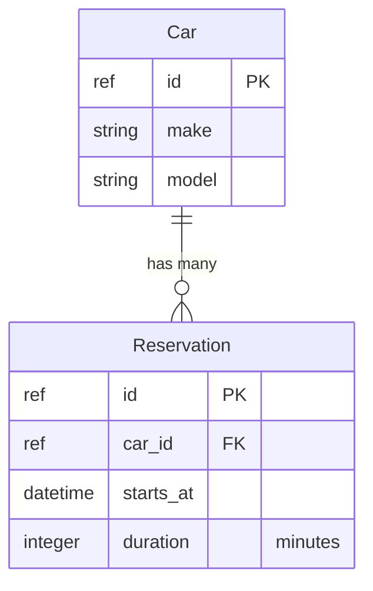

```mermaid
erDiagram
    Car {
        ref id PK
        string make
        string model
    }
    Reservation {
        ref id PK
        ref car_id FK
        datetime starts_at
        integer duration "minutes"
    }
    Car ||--o{ Reservation : "has many"
```
